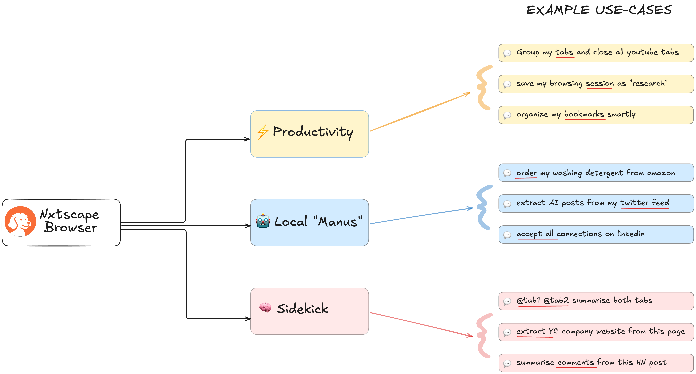

# The Open-source Agentic Browser.
Nxtscape ("next-scape") is an open-source **agentic browser** – your privacy-first alternative to closed-source browsers (like Arc, Dia, Perplexity Comet). Built on Chromium, Nxtscape lets you run **Manus like agents** locally and boost your productivity with an AI-sidekick.

### $${\color{red}Download}$$ [link](https://bit.ly/4k0gjsD) for macOS

We'd love to hear what problems you'd like to see solved! Share your ideas through our [anonymous form](https://dub.sh/nxtscape-feature-request).

# **Looks like Chrome, but with AI superpowers.** 

We believe the future is AI agents automating your work, and we want to be the **_open source browser_** that can do it **_locally and securely_** instead of sending your data to a search or ad company. 

## The Vision: A Browser That Works For You 💡
For the first time since Netscape in 1994, it feels like we can reimagine browsers from scratch. The browser of tomorrow might not look like what we have today! That's why we're building Nxtscape - an open-source, agentic browser for the next era.

We saw how tools like Cursor gave developers a 10x productivity boost, yet the browser—where we spend our entire day—feels stuck and we're constantly fighting it. I constantly have 70+ tabs open and lose track of them. Can't AI help group or close them? Simple workflows, like "order Tide Pods from my Amazon order history," should just work with agents right now. And form-filling is another huge pain that AI should be able to solve.

## Features 🎁
- 🏠 Feels like home - works with all your Chrome extensions
- 🤖 AI agents that run on YOUR browser, not in the cloud
- 🔒 Privacy first - bring your own keys or use local models with Ollama. Your browsing history stays on your computer
- 🚀 Open source and community driven - see exactly what's happening under the hood
- 🤝 (coming soon) MCP store to one-click install popular MCPs and use them directly in the browser bar
- 🛡️ (coming soon) Built-in AI ad blocker that works across more scenarios!

## Demos

### 🤖 AI Agents in Action (<a href="https://storage.googleapis.com/felafax-public/nxtscape/nxtscape-agent.mp4" target="_blank">video</a>)

### 💬 Local AI Chat (<a href="https://storage.googleapis.com/felafax-public/nxtscape/nxtscape-chat.mp4" target="_blank">video</a>)

### ⚡ Productivity (<a href="https://storage.googleapis.com/felafax-public/nxtscape/nxtscape-productivity.mp4" target="_blank">video</a>)

## ✨ What Makes Nxtscape Different?
We know there are other browsers. Here's why Nxtscape stands out:

### Nxtscape vs Chrome
While we're grateful for Google open-sourcing Chromium, the Chrome browser hasn't evolved much over the last 10 years and it lacks meaningful AI features (agentic automation, MCP support, ...). 

### Nxtscape vs Brave
We love what Brave started, but they've spread themselves too thin with crypto, search, VPNs, and other projects. Nxtscape is **laser-focused** on building the best **AI-powered, productivity-focused, private browser**. We want to bring you latest AI features sooner, like **agentic automation and integrating MCP!**

### Nxtscape vs Arc/Dia
Many loved Arc, but it was closed source. When the company abandoned it, users were left behind. That **will never happen** with Nxtscape. We are **100% open source**. If you don't like the direction we're going, you or the community can fork the code and build your own version. Power to the people!

### Nxtscape vs Perplexity Comet
Perplexity is a search company. Your browser history will likely be used for ad targeting eventually. We are **NOT** a search company. If you're switching from Chrome, choose a truly privacy-first browser instead of another data collector. Choose Nxtscape.

## Get Involved! 🙌
Nxtscape is open source! We believe in building _with_ our community. Let us know what features you want!

- 💬  Join our [Discord](https://discord.gg/YKwjt5vuKr)
- 🐦  Follow us on [Twitter/X](https://twitter.com/nxtscape)

## Acknowledgments 🙏

Nxtscape is inspired by these amazing open-source projects: [browser-use](https://github.com/browser-use/browser-use), [Nanobrowser](https://github.com/nanobrowser/nanobrowser), and [Stagehand](https://github.com/browserbase/stagehand) and of course wouldn't have been possible without [Chromium](https://github.com/chromium/chromium). Grateful to the open-source community!

## License 📜
Nxtscape is licensed under AGPL-3.0 license. See the `LICENSE` file for details.

 

